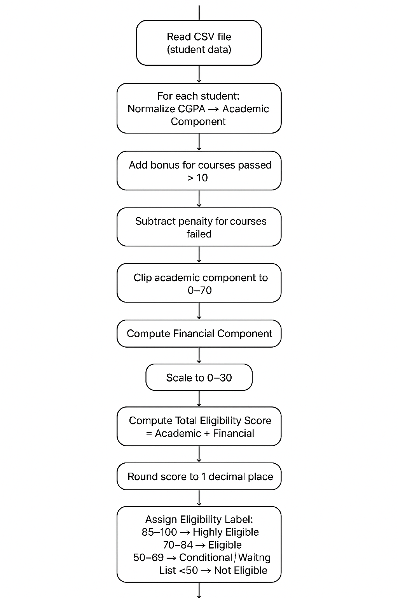

# Scholarship Eligibility Scoring System

## 1. Overview

This project evaluates student eligibility for scholarships based on academic performance and financial need. The system calculates an **eligibility score** and assigns a corresponding label to each student.

---

## 2. Eligibility Scoring Criteria

### 2.1 Academic Performance (70% of total score)

| Input            | Description                                    | Scoring / Calculation |
|-----------------|------------------------------------------------|---------------------|
| CGPA             | Cumulative Grade Point Average (scale 4.0 or 5.0) | Normalize to 0–100: `gpa_normalized = (cgpa / scale) * 100` → Scale to 70 points: `academic_component = gpa_normalized * 0.7` |
| Courses Passed   | Total number of courses passed                 | Bonus: +3 points if courses passed > 10 |
| Courses Failed   | Total number of courses failed                 | Penalty: −1 point for every 2 courses failed |
| **Final Academic Score** | Weighted academic contribution | Clipped to 0–70 points |

### 2.2 Financial Need (30% of total score)

| Input              | Description                           | Points                              |
|-------------------|---------------------------------------|------------------------------------|
| Income Band        | Self-reported annual family income    | <300k → 8, 300k–600k → 5, 600k–1M → 3, 1M–2M → 1, >2M → 0 |
| Orphan Status      | Whether the student is a full orphan | Yes → 5, No → 0                    |
| Number of Dependents | Total dependents in the family       | >4 → 5, 3–4 → 3, 1–2 → 1, 0 → 0   |
| **Final Financial Score** | Weighted financial contribution  | `(total_financial_points / 18) * 30` → 0–30 points |

### 2.3 Final Eligibility Score

---

## 3. Eligibility Labels

| Score Range  | Label                        |
|-------------|-------------------------------|
| 85–100      | Highly Eligible              |
| 70–84       | Eligible                     |
| 50–69       | Conditional / Waiting List  |
| <50         | Not Eligible                 |

---

## 4. Tie-break Rules

If two students have the same eligibility score:

1. Higher normalized CGPA wins.
2. If CGPA equal → lower family income band wins (more financially needy).
3. If still tied → fewer courses failed wins.
4. If still tied → committee review or random selection.

---

## 5. Key Columns in Output

The Python script generates the following columns in the final output:

- `student_name`
- `student_id`
- `department`
- `faculty`
- `institution`
- `eligibility_score`
- `eligibility_label`

---

## 6. Usage

1. Update the CSV file `sample_data.csv` with student details.
2. Run the Python script `eligibility_scoring.py`.
3. The script outputs a table with the key columns and also saves the results to `eligibility_result.csv`.

---

## 7. Flowchart

Below is a visual representation of the scoring process:

---

## 8. Scoring Logic Documentation

The Python script includes inline comments to explain each step:

- Normalizing CGPA and calculating academic component
- Adding bonuses and penalties
- Computing financial component and scaling
- Calculating final eligibility score
- Assigning eligibility label
- Sorting results and applying tie-breakers

This ensures transparency and reproducibility of the scoring methodology.
